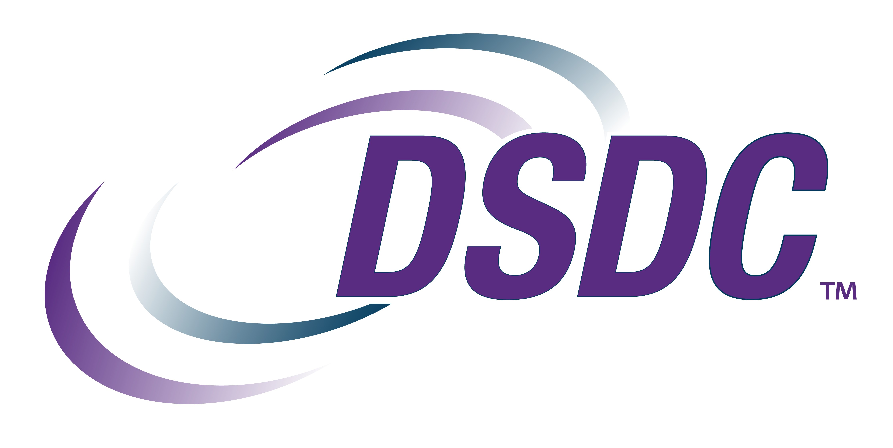

# How do I contribute

There are multiple ways to contribute to the DSDC.

## Using GitHub Discussions

We use GitHub Discussions to start public communication whether its for public feedback, questions, discussions, suggestions, or announcements. Meeting notes and decisions will be recorded under each API section as they occur. Discussions will happen at the [dsdcapis organization level](https://github.com/orgs/dsdcapis/discussions).

## Using GitHub Issues

Issues will be used to record future work, enhancements, or issues. Each repository will have issues individually for tracking purposes.

# What is the governance process

Each repository will lay out the rules for governance.

# What does each repository do

The following explains what each repository is for.

## full-truckload

The [full-truckload](https://github.com/dsdcapis/full-truckload) repository is the home of all artifacts created by the DSDC related to Truckload. Go to the repository for more information on contributing and governance.

## community

The [community](https://github.com/dsdcapis/community) repository holds all discussions for the DSDC APIs. Go to the repository for more information.
